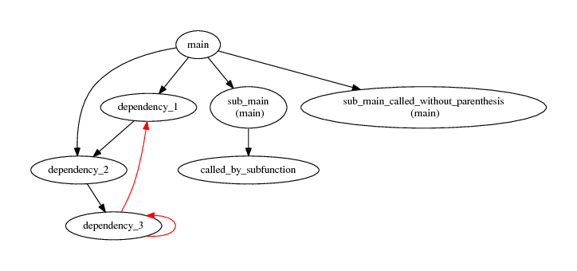
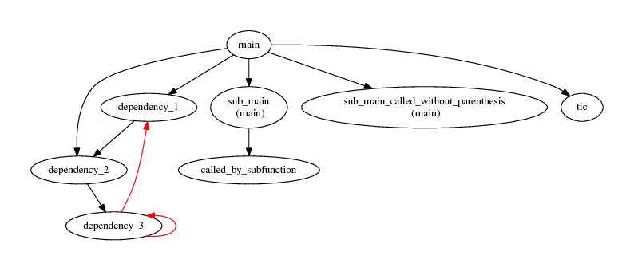
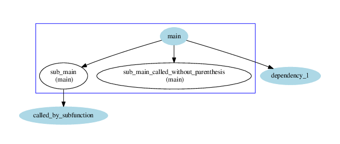
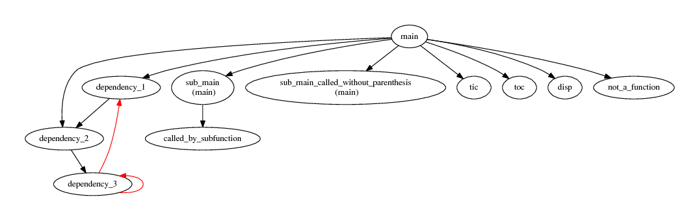
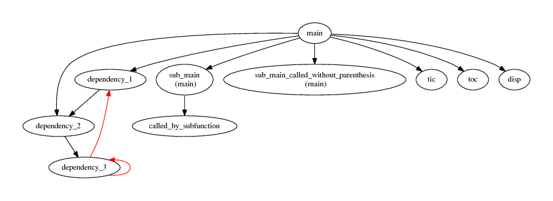
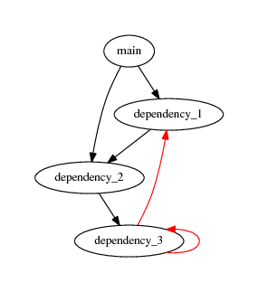
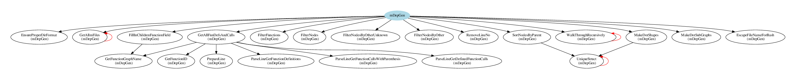

# mDepGen - Dependency Generator for GNU Octave .m files 

# Introduction
Function parse all [GNU Octave](https://www.gnu.org/software/octave/) m files in specified
directory, identifies all functions and calls, finds out which function calls which one, creates
graph in [Graphviz](http://www.graphviz.org/) format starting from specified function, calls
[Graphviz](http://www.graphviz.org/) to generate graph in pdf format.

This dependency generator does not provide syntax analysis of m files, it only does some regular
expression matching.

It can:

1. find out recursions,
2. work with sub functions,
3. hide or show selected function calls.

This code is based on [dep - Matlab/Octave dependency report](https://www.mathworks.com/matlabcentral/fileexchange/27787-dep) by *Thomas Guillod*.

## Help
(just a copy of `help mDepGen` from GNU Octave command line)

    -- Function File: = mDepGen (INDIR, STARTFUNCTION, GRAPHFILE)
    -- Function File: = mDepGen (INDIR, STARTFUNCTION, GRAPHFILE, SPECIALS)
    -- Function File: = mDepGen (INDIR, STARTFUNCTION, GRAPHFILE, SPECIALS,
             FORBIDDEN)
    -- Function File: = mDepGen (..., PROPERTY, VALUE)
    
        Function parse all m-files in string INDIR, identifies all
        functions and calls, finds out which function calls which one,
        creates graph GRAPHFILE in Graphviz format starting from
        STARTFUNCTION, calls Graphviz to generate graph in pdf format.
    
        Recursions are identified and plotted on graph by different colour.
        m-Files in sub directories are also parsed, however function
        'addpath' is not understood.
    
        Function calls in code of m-files are identified as being followed
        by parenthesis '('.  However some functions are called without
        parenthesis (like code 't=tic;').  These functions will be
        identified only if:
        called function is main function in an m-file,
        called function is sub function in an m-file,
        called function is listed in SPECIALS
    
        Input variables detailed:
        'INDIR - Directory containing m-files to be processed.'
        'STARTFUNCTION - File name of a starting function of the'
             graph.  Either a full path to the m-file or only a file name.
             In the last case a INDIR will be prepended to the file name.
        'GRAPHFILENAME - File name of a resulted graph. Either'
             a full path of the graph or only a file name.  In the last
             case a INDIR will be prepended to the file name.
        'SPECIALS - Cell of character string with function names.'
             These functions will be always displayed in the graph.
        'FORBIDDEN - Cell of character string with function names.'
             These functions will not be displayed in the graph.
    
        Behaviour of graph can be fine tuned by PROPERTY VALUE pairs.
        Default value is in brackets.
        'graphtype' (dependency) - string, type of output graph. Possible values:
             'dependency' - Graph of dependency.
             For now it is the only possibility.  More will maybe come in
             future.
        'plotmainfuns' (1) - boolean, main functions (first one in m-file) will be plotted.
             Be carefull to switching this off.  This could result in empty
             graph.
        'plotsubfuns' (1) - boolean, sub functions (second and others in m-file) will be
             plotted.
        'plotspecials' (1) - boolean, functions listed in Specials will be
             plotted.
        'plototherfuns' (1) - boolean, function calls followed by parenthesis '(' and
             existing in Octave namespace will be plotted.
        'plotunknownfuns' (1) - boolean, anything resembling function call (word
             followed by parenthesis '(' will be plotted.  Due to
             limitations of this program variables can be considered as
             function calls (i.e.  code 'variable(:)').
    
        Example:
             mDepGen('.', 'mDepGen', 'example_graph', {'fopen', 'fgetl'}, {'PrepareLine'}, 'plototherfuns', 1)

## Examples
### Example 1 - simple
Following code:

    mDepGen('test_functions/', 'main', 'readme_fig1')

will generate dependency graph for functions in directory `test_functions` and the starting point is
function `main` from m file `main.m`.

One can see two recursions marked by red line. Only functions defined in m files in specified
directory have been found.

### Example 2 - Special 
Code:

    mDepGen('test_functions/', 'main', 'readme_fig2', {'tic'})

will generate dependency graph where calls to function `tic` is also shown (input parameter
Special).

### Example 3 - Forbidden
Code:

    mDepGen('test_functions/', 'main', 'readme_fig2', {}, {'dependency_3'})

will generate dependency graph where calls to function `dependency_3` is hidden (input parameter
Forbidden).

### Example 4 - plot all
Code:

    mDepGen('test_functions/', 'main', 'readme_fig4', {}, {}, 'plototherfuns', 1, 'plotunknownfuns', 1)

will generate dependency graph where all possible calls to functions are shown. However this will
probably generate false positive, as is shown in following figure. `not_a_function` is not a
function, but a variable:

### Example 5 - plot known functions
Code:

    mDepGen('test_functions/', 'main', 'readme_fig5', {}, {}, 'plototherfuns', 1)

will generate dependency graph where all calls to functions known to GNU Octave are shown. This
prevents false positives shown in previous figure, however cannot find calls to functions without
parenteses.

### Example 6 - do not plot sub functions
Code:

    mDepGen('test_functions/', 'main', 'readme_fig6', {}, {}, 'plotsubfuns', 0)

will generate dependency graph where all subfunctions are not shown.

### Example 7 - complex figure
Following figure was obtained by plotting dependency of `mDepGen.m` using following code:

    mDepGen('.', 'mDepGen', 'readme_fig7')

