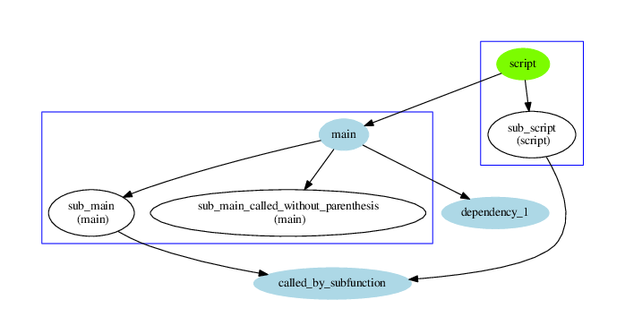
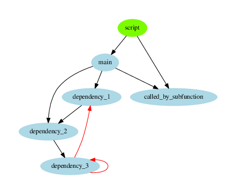

# mDepGen - Dependency Generator for GNU Octave .m files 

# Introduction
Function parse all [GNU Octave](https://www.gnu.org/software/octave/) m files in specified
directory, identifies all functions and calls, finds out which function calls which one, creates
graph in [Graphviz](http://www.graphviz.org/) format starting from specified function, calls
[Graphviz](http://www.graphviz.org/) to generate graph in pdf format.

This dependency generator does not provide syntax analysis of m files, it only does some regular
expression matching.

It can:

1. find out recursions,
2. work with sub functions and scripts,
3. hide or show selected functions or groups of functions.

This code is partly based on [dep - Matlab/Octave dependency report](https://www.mathworks.com/matlabcentral/fileexchange/27787-dep) by *Thomas Guillod*.

## Help
'mDepGen' is a function from the file /home/martin/zal/Dropbox/nastaveni-ln/prog/octave/mDepGen - github/mDepGen.m

 -- Function File: = mDepGen (INDIR, STARTFUNCTION, GRAPHFILE)
 -- Function File: = mDepGen (..., SPECIALS)
 -- Function File: = mDepGen (..., SPECIALS, FORBIDDEN)
 -- Function File: = mDepGen (..., SPECIALS, FORBIDDEN, PROPERTY, VALUE,
          ...)

     Function parse all m-files in directory INDIR, identifies all
     functions and calls, finds out which function calls which one,
     creates graph GRAPHFILE in Graphviz format starting from function
     STARTFUNCTION, and calls Graphviz to generate graph in pdf format.

     This function does not provide syntax analysis of m-files, it only
     does some regular expression matching.

     Recursions are identified and plotted on graph by different colour.
     m-files in sub directories are also parsed, however function
     'addpath' is not yet understood.

     Function calls in are identified as something being followed by
     parenthesis '('.  However some functions are called without
     parenthesis (like code 't=tic;').  These functions will be
     identified only if:
     1, called function is main function in a parsed m-file,
     2, called function is sub function in a parsed m-file,
     3, called function is listed in SPECIALS.
     If "plotunknownfuns" is set to 1 (see lower), false positives can
     be generated, for example in code 'a=variable(5)'.  This can be
     also prevented using FORBIDDEN.

     Input variables:
     INDIR
          Directory with m-files to be processed.
     STARTFUNCTION
          File name of a starting function of the graph.  Either a full
          path to the m-file or only a file name.  In the last case
          INDIR will be prepended to the file name.
     GRAPHFILENAME
          File name of a resulted graph.  Either a full path of the
          graph or only a file name.  In the last case a INDIR will be
          prepended to the file name.
     SPECIALS
          Cell of character strings with function names.  These
          functions will be always displayed in the graph.
     FORBIDDEN
          Cell of character strings with function names.  These
          functions will never be displayed in the graph.

     Graph can be fine tuned by PROPERTY - VALUE pairs.  Default value
     is in brackets.
     "graphtype"
          ("dependency"), string, type of output graph.  Possible
          values:
          "dependency"
               Graph showing dependency of m-files.  For now it is the
               only possibility.  More maybe will come in future.
     'plotmainfuns'
          (1), boolean, nonzero means main functions (first one in
          m-file) will be plotted.  Be carefull to switching this off.
          This could result in empty graph.
     'plotsubfuns'
          (1), boolean, nonzero means sub functions (second and others
          in m-file) will be plotted.
     'plotspecials'
          (1), boolean, nonzero means functions listed in Specials will
          be plotted.
     'plototherfuns'
          (1), boolean, nonzero means functions followed by parenthesis
          '(' and existing in Octave name space will be plotted.
     'plotunknownfuns'
          (1), boolean, nonzero means anything resembling function call
          (word followed by parenthesis '(' will be plotted.  Due to
          limitations of this program variables can be considered as
          function calls (i.e.  code 'variable(:)').
     'plotfileframes'
          (1), boolean, if set frames putting together main function and
          its subfunction from single m-file will be plotted.  Option
          has no sense if plotsubfuns is set to 0.
     'verbose',
          (2), integer, if set to zero no output will be printed out.
          If set to 1, only status of process will be shown.  If set to
          2, all various informations will be shown.
     'debug'
          (0), boolean, if set, various debug informations will be saved
          to multiple files.

     Example:
          mDepGen('.', 'mDepGen', 'example_graph', {'fopen', 'fclose'}, {'PrepareLine'}, 'plototherfuns', 1)

## Examples
### Example 1 - simple
Following code:

    mDepGen('test_functions/', 'main', 'readme_fig1')

generates dependency graph of functions in directory `test_functions` and the starting point is
function `main` from m file `main.m`.

One can see `main.m` contains one main function which calls two subfunctions, and these are marked
by a frame showing content of one m-file. Main functions of all m-files are shown in blue,
subfucntions are shown in white. Two recursions are marked by red line. Only functions defined in
m-files located in specified directory and depending on `main.m` are shown.

### Example 2 - Specials 
Code:

    mDepGen('test_functions/', 'main', 'readme_fig2', {'tic'})

generates dependency graph where calls to function `tic` are also shown (input parameter
Special).

### Example 3 - Forbidden
Code:

    mDepGen('test_functions/', 'main', 'readme_fig2', {}, {'dependency_2'})

generates dependency graph where calls to and from function `dependency_2` are hidden (input parameter
Forbidden). One can see function `dependency_3` also is hidden, because it is only called by hidden
`dependency_2` (and by itself).

### Example 4 - plot other functions
Code:

    mDepGen('test_functions/', 'main', 'readme_fig5', {}, {}, 'plototherfuns', 1)

generates dependency graph where all calls to functions in m-files and calls to functions known to
GNU Octave are shown. However functions known to GNU Octave not followed by parentheses are not
found.

### Example 4 - plot other and unknown functions
Code:

    mDepGen('test_functions/', 'main', 'readme_fig4', {}, {}, 'plototherfuns', 1, 'plotunknownfuns', 1)

generates dependency graph where all possible calls to all possible functions are shown (function is
word followed by `(`). However this could generate false positives, as is shown in the figure:
`not_a_function` is not a function, but a variable:

### Example 6 - hidden sub functions
Code:

    mDepGen('test_functions/', 'main', 'readme_fig6', {}, {}, 'plotsubfuns', 0)

generates dependency graph where all subfunctions are hidden. However functions called by
subfunctions are also hidden.

### Example 7 - complex figure
Following figure was obtained by plotting dependency of `mDepGen.m` using following code:

    mDepGen('.', 'mDepGen', 'readme_fig7', {}, {}, 'plotfileframes', 0)

One can see quite complex structure with several recursions. Frame grouping main function and
subfunctions of particular m-files was switched off because dependencies from only one m-file is shown.

