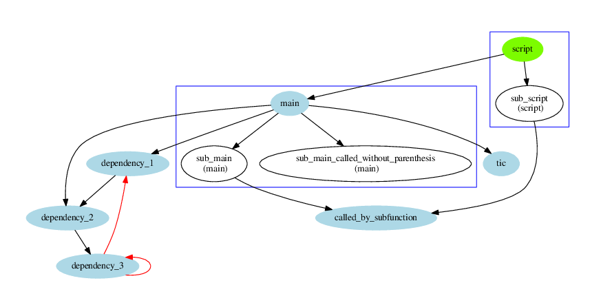
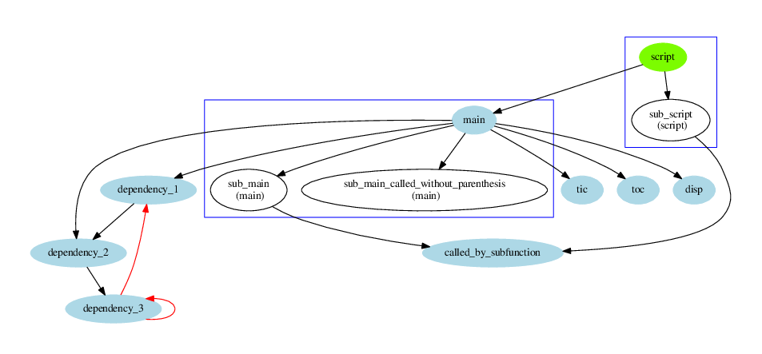
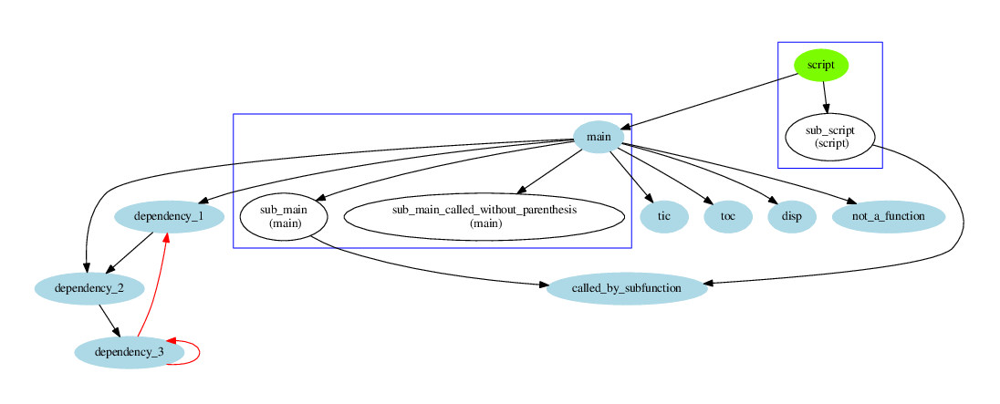
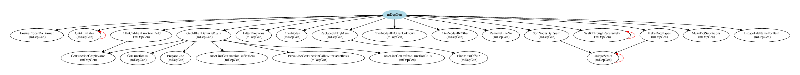

# mDepGen - Dependency Generator for GNU Octave .m files 

Function parse all [GNU Octave](https://www.gnu.org/software/octave/) m files in specified
directory, identifies all functions and calls, finds out which function calls which one, creates
graph in [Graphviz](http://www.graphviz.org/) format starting from specified function, calls
[Graphviz](http://www.graphviz.org/) to generate graph in pdf format.

Recursions are identified and plotted on graph by different colour.
All m files in sub directories are also parsed, however function `addpath`
is not yet understood.

Function calls in code of m files are identified as being followed
by parenthesis `(`. However some functions are called without 
parenthesis (like code `t=tic;`). These functions will be identified 
only if:

1. called function is main function in an m file,
2. called function is sub function in an m file,
3. called function is listed in mDepGen parameters (like Special or Forbidden).

This dependency generator do not provide syntax analysis of m files, it only does some regular
expression matching.

For the use see integrated help by invoking `help mDepGen` in GNU Octave.

This code is based on [dep - Matlab/Octave dependency report](https://www.mathworks.com/matlabcentral/fileexchange/27787-dep) by *Thomas Guillod*.

## Example 1 - simple
Following code:

    mDepGen('test_functions/', 'main', 'readme_fig1')

will generate dependency graph for functions in directory `test_functions` and the starting point is
function `main` form m file `main.m`.

One can see two recursions marked by red line. Only functions defined in m files in specified
directory have been found.

## Example 2 - Special 
Code:

    mDepGen('test_functions/', 'main', 'readme_fig2', {'tic'})

will generate dependency graph where calls to function `tic` is also shown (input parameter
Special).

## Example 3 - Forbidden
Code:

    mDepGen('test_functions/', 'main', 'readme_fig2', {}, {'dependency_3'})

will generate dependency graph where calls to function `dependency_3` is hidden (input parameter
Forbidden).

## Example 4 - plot all
Code:

    mDepGen('test_functions/', 'main', 'readme_fig4', {}, {}, 'plototherfuns', 1, 'plotunknownfuns', 1)

will generate dependency graph where all possible calls to functions are shown. However this will
probably generate false positive, as is shown in following figure. `not_a_function` is not a
function, but a variable:

## Example 5 - plot known functions
Code:

    mDepGen('test_functions/', 'main', 'readme_fig5', {}, {}, 'plototherfuns', 1)

will generate dependency graph where all calls to functions known to GNU Octave are shown. This
prevents false positives shown in previous figure, however cannot find calls to functions without
parenteses.

## Example 6 - do not plot sub functions
Code:

    mDepGen('test_functions/', 'main', 'readme_fig6', {}, {}, 'plotsubfuns', 0)

will generate dependency graph where all subfunctions are not shown.

## Example 7 - complex figure
Following figure was obtained by plotting dependency of `mDepGen.m` using following code:

    mDepGen('.', 'mDepGen', 'readme_fig7')

